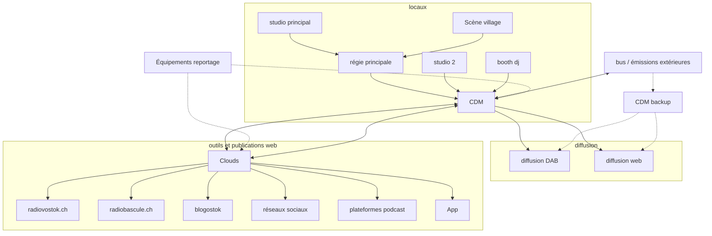

#  Infrastructure Technique Radio Vostok

//TODO blabla présentation

## Vision d'ensemble

## Inventaire 

// TODO
(pistes outils inventaire à noter ici)

## État des services 

// TODO
(pistes outils monitoring à noter ici)

monitoring actuel :
- détecteur de silence
    - flux internet
    - la vostoke (// TODO à fiabiliser)
    - DAB (//TODO à remettre en service)
- ..