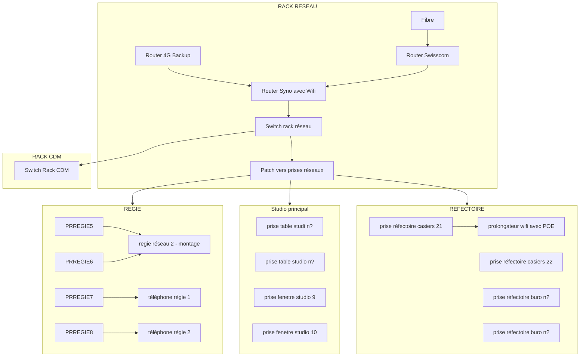

#  Le Cendre De Modulation

## Alimentation électrique

- prise C.C13.L1
    - vers onduleur
    - alimente les éléments essentiels à la diffusion radio : 
        - postes de diffusion
        - routeur
        - switchs réseaux
        - PC dédié DAB et encodeur
        - nas antenne
        - nas production
- prise C.C12.L2
    - vers multriprise 'sans onduleur' du rack CDM
    - pour tous les autres appareils du CDM
        - AETA
        - nas backup
        - radio internet (monitoring)
        - radio DAB (monitoring)

## Fibre Internet

une prise dédiée

## Rack réseau

## Rack CDM

### Patch audio CDM/régie

ENTREES

| 1-2                          | 3-4                              | 5-6                        |
|----------------------------  | ---------------------------------|----------------------------|
| Vostok monit. dep. ant. L-R  | La VostokE monit. dep. ant. L-R  | Vostok monit. internet L-R |

| 7          | 8 | 9 | 10 | 11 | 12 |
|------------|---|---|----|----|----|
| AETA out L |   |   |    |    |    |

SORTIES

| 1               | 2                 |
|-----------------|-------------------|
| Studer Master 1 | Studer Master 2   |

| 3                 | 4 |
|-------------------|---|
| (vers AETA IN)    |   |

### PC dédié diffusion DAB: 

- IP : 192.168.1.146
- debian 12
- allumage auto en cas de coupure électrique
- nom de machine sur le réseau : dab
- logins : cf  keepass
- interface web encodeur : http://192.168.1.146:8080 / documentation : http://192.168.1.146:8080/help
- pour les images : 
  - via ftp dans carrousel/uniqID pour carrousel permanent
  - via ftp dans live/uniqID pour image lié au programme en cours (reste max 5min)
  - ou via API cf doc
  - format d'image jpg 320 par 240 et en dessous de 15 ko

### Encodeur DAB : 

- IP : 192.168.1.4

### Poste Auto 23 et sa carte son MOTU 896mk3

**Poste Auto 23 = poste de diffusion principal Radio Vostok**

- IP : 192.168.1.6

**Carte son MOTU 896mk3**

reliée en USB 2.0 au Poste Auto 23

ENTREES ANALOG

| 1-2               | 3-4            | 5-8                          |
|-------------------|----------------| -----------------------------|
| Studer Master 1-2 | Studio 2 - 1-2 | non assignées pour le moment |

SORTIES ANALOG 

| 1-2                         | 3-4                     | 5-6                                             | 7-8                          |
|-----------------------------|-------------------------|-------------------------------------------------|------------------------------|
| Vostok monit. dep. ant. L-R | routing vers La VostokE | Vostok monit. dep. ant. L-R (copie pour stud 2) | non assignées pour le moment |

SORTIES DIGITALES

AES/EBU --> vers Encodeur DAB

### NAS Synology RS1221+ - Production

- IP : http://192.168.1.106/
- NOM : NAS-Production
- RAM : 32GO
- CAPACITE : 
    - 10.5 TO Volume 1 (4 HDD de 6TO)
    - 1.8 TO Volume 2 (2 SSD de 2TO)

### NAS Synology - Antenne

- IP http://192.168.1.44/
- NOM : NASantenne
- CAPACITE : 1.8 TO (2 HDD de 2TO)

### NAS Synology DS 218 Play - Backup

- IP : http://192.168.1.9/
- NOM : Disktation
- CAPACITE : 10.9 TO (2 HDD de 12TO)

### Codec AETA Micro Scoop

- IP : http://192.168.1.134/
- Son rôle : réception de duplex via app mobile
  > - "The cost effective way to perform point to point AoIP connections !"
  > - https://www.aeta-audio.com/en/products/%c2%b5scoop-2/
- manuel : owncloud-vostok/VOSTOK_DOCUMENTATION/BASE DE CONNAISSANCE/MANUELS
- LOGIN : cf keepass / "codec aeta micro scoop"
- Config :
    * Configuré pour le moment en OPUS mono
    * s'utilise sur des dispositifs mobiles avec l'app web 
    * Connexion avec la régie : cf patch audio régie/CDM, arrive ensuite sur la tranche 5 de la Studer, et son retour sort via le MPX out 3
    
### Radio Internet (monitoring)

