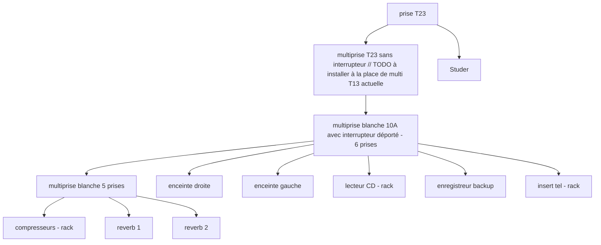
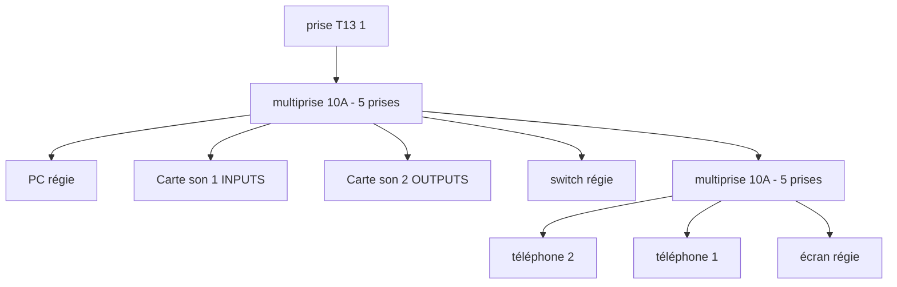
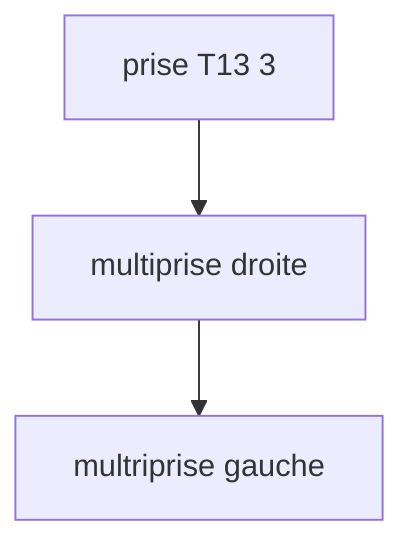

# Régie principale

## Description et vue d'ensemble

## Console Studer série 900
Suivi des travaux sur la Studer : https://trello.com/b/QVSUWnn3/tech-studer

### Plan d'implémentation

#### ENTREES 

##### Entrées MONO

1-8

|      | 1                         | 2 | 3        | 4        | 5                 | 6                          | 7                       | 8 |
|------|---------------------------|---|----------|----------|-------------------|----------------------------|-------------------------|---|
| MIC  | MIC ANIM (PATCH STUDIO 1) |   |          |          |                   |                            |                         |   |
| LINE |                           |   | PC PFL L | PC PFL R | AETA OUTPUT (CDM) | TELOS OUTPUT (téléphone 1) | STUDER TELEPHONE OUTPUT |   |
| TAPE |                           |   |          |          |                   |                            |                         |   |

9-16

| ENTREE | 9 | 10 | 11 | 12             | 13             | 14             | 15              | 16              |
|--------|---|----|----|----------------|----------------|----------------|-----------------|-----------------|
| MIC    |   |    |    | PATCH STUDIO 7 | PATCH STUDIO 8 | PATCH STUDIO 9 | PATCH STUDIO 10 | PATCH STUDIO 11 |
| LINE   |   |    |    |                |                |                |                 |                 |
| TAPE   |   |    |    |                |                |                |                 |                 |

17-22

| ENTREE | 17                                                                             | 18                     | 19                     | 20                     | 21                    | 22                     |
|--------|--------------------------------------------------------------------------------|------------------------|------------------------|------------------------|-----------------------|------------------------|
| MIC    | PATCH STUDIO 12 / LE FADER EST SOUVENT ASSIGNE COMME MASTER DE LA TRANCHE ANIM | MIC 2 (PATCH STUDIO 2) | MIC 3 (PATCH STUDIO 3) | MIC 4 (PATCH STUDIO 4) | MIC 5(PATCH STUDIO 5) | MIC 6 (PATCH STUDIO 6) |
| LINE   |                                                                                |                        |                        |                        |                       |                        |
| TAPE   |                                                                                |                        |                        |                        |                       |                        |

##### Entrées STEREO

| ENTREE | 1    | 2    | 3    | 4    | 5                                               | 6                   |
|--------|------|------|------|------|-------------------------------------------------|---------------------|
| LINE 1 | PC A | PC B | PC 1 | PC 2 | // TODO --> CD                                  | // TODO --> REVERB1 |
| LINE 2 | PC 5 | PC 6 | PC 7 |      | TMP : ANCIENNE WORKSTATION // TODO --> REVERB 2 | PC 8                |

##### Entrées MONITORING

| 1                                 | 2                                | 3        | 4        | 5        |
|-----------------------------------|----------------------------------|----------|----------|----------|
| Retour Poste Auto (PATCH CDM 1-2) | Retour Radio DAB (PATCH CDM 3-4) | à cabler | à cabler | à cabler |

(d'autres entrées monitoring peuvent être disponibles mais il faudrait des cables adaptés pour pouvoir les utiliser)

#### SORTIES

##### MASTER

| 1         | 2          | 3          | 4          |
|-----------|------------|------------|------------|
| DISTRIB 1 | DISTRIB 2  | MOTU IN 3  | MOTU IN 4  |

##### AMPLI DE DISTRIB

| SORTIE | 1             | 2         | 3         | 4         |
|--------|---------------|-----------|-----------|-----------|
| 1      | CDM ANTENNE L | MOTU IN 1 | VILLAGE 1 | REC BKP L |
| 2      | CDM ANTENNE R | MOTU IN 2 | VILLAGE 2 | REC BKP R |

##### AUX

| AUX 1 |  | AUX 2 | AUX 3 | AUX 4 (stereo)                            |
|-------|--|-------|-------|-------------------------------------------|
|       |  |       |       | CASQUES INVITES STUDIO (PATCH STUDIO 1-2) |

###### STUDIO OUT

| STUDIO OUT L                                            | STUDIO OUT R                           |
|---------------------------------------------------------|----------------------------------------|
| Tannoy écoute Studio L (PATCH STUDIO 3 - a un problème) | Tannoy écoute Studio  (Patch Studio 4) |

###### MPX OUT

| MPX OUT 3 | MPX OUT 4                     | MPX OUT 5                          |
|-----------|-------------------------------|------------------------------------|
|           | INSERT TELOS IN (téléphone 1) | INSERT STUDER TEL IN (téléphone 2) |

#### Boosters

|     | 1          | 2          | 3          | 4          | 5           | 6           | 7           | 8           |
|-----|------------|------------|------------|------------|-------------|-------------|-------------|-------------|
| OUT | comp 1 IN  | comp 2 IN  | comp 3 IN  | comp 4 IN  | MOTU IN 5   | MOTU IN 6   | MOTU IN 7   | MOTU IN 8   |
| IN  | comp 1 OUT | comp 2 OUT | comp 3 OUT | comp 4 OUT | MOTU OUT 17 | MOTU OUT 18 | MOTU OUT 19 | MOTU OUT 20 |

#### TEL HYBRID

pour utilisation de l'insert téléphonique interne

OUT -->  LINE 6
IN ←MPX OUT 5 

de plus sont cablées en entrées ligne téléphonique la prise réseau 8 et en sortie ligne téléphonique le combiné 'Studer'

## Siderack

**Caractéristiques Siderack régie :**	

 - 4U plan incliné
 - 8U plan plat

**Éléments Siderack régie :**

_Plan incliné_
- 1U pour insert tel 
- 1U enregistreur backup
- 2U pour lexteur CD Tascam

_Plan plat_
- 2 cartes sons MOTU : 2U
- compresseurs : 1U // à installer
- 2U pour 2 reverbs lexion // TODO ä installer

## Cablage électrique

En régie nous avons 3 prises T13 et une T23
cela correspond à deux interrupteurs sur le tableau électrique, 1 pour les 3 T13, avec 13A et 1 pour la T23 avec 16A

de gauche à droite en regardant le boitier électrique :

- T23 : audio, non permanent avec interrupteur, alimentant :

  
- T13 1 : informatique, permanent, alimentant :

  
- T13 2 : informatique bureautique, permanent, alimentant : // TODO
    - pour le moment on tire un cable de 5 m dans la direction du bureau
- T13 3 : prolongateur électrique pour branchements ponctuels, vers multiprisse à gauche et à droite de la régie

## Cablage réseau

4 prises réseaux murales reliées au patch CDM :

5 --> réseau - PC régie workstation
6 --> réseau - PC régie montage
7 --> téléphonique analogique 1 - insert/combiné Telos
8 --> téléphonique analogique 2 - insert/comibiné Studer

## Signal flow audio
