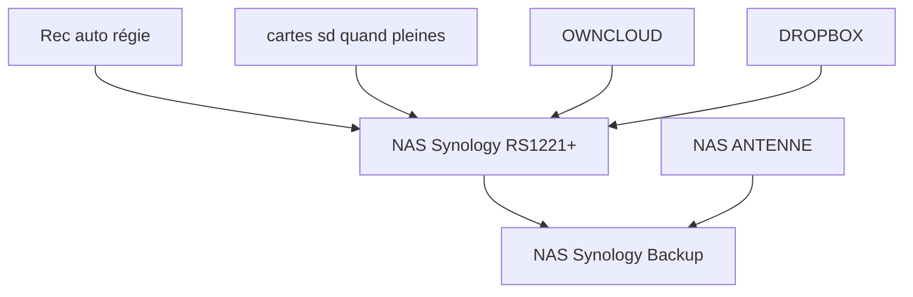
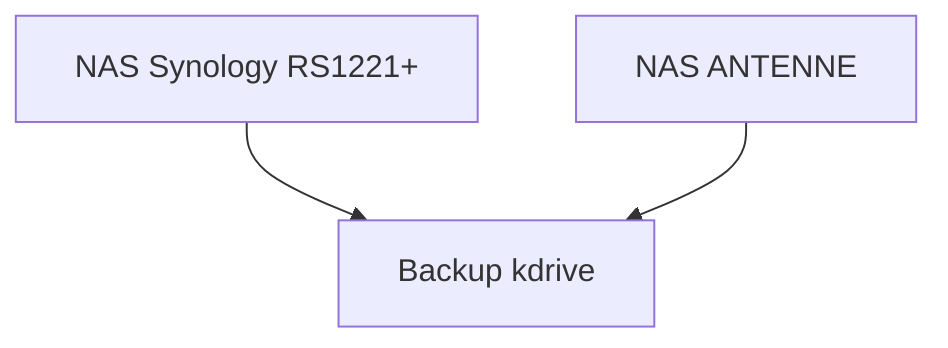

# Les sauvegardes

## Sauvegardes locales

Voici les données qui sont sauvegardées localement

(le backup vers le NAS Synology backup se déroule tous les soirs à 3h)

## Sauvegardes distances

Voici les données qui sont sauvegardées vers kdrive

la synchro kdrive se fait uniquement en envoyant des données depuis les NAS vers kdrive, pas dans l'autre sens

(le backup vers kdrive se déroule tous les soirs à 3h)

