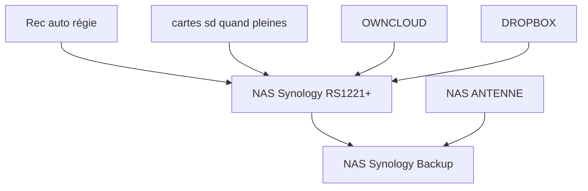

# Les sauvegardes

## Sauvegardes locales

Voici les données qui sont sauvegardées localement

```mermaid
flowchart TD
PROD[NAS Synology RS1221+] --> BACKUP[NAS Synology Backup]
REGIE[Rec auto régie] --> PROD
ANTENNE[NAS ANTENNE] --> BACKUP
SD[cartes sd quand pleines] --> PROD
OWNCLOUD --> PROD
DROPBOX --> PROD
```

## Sauvegardes distances

