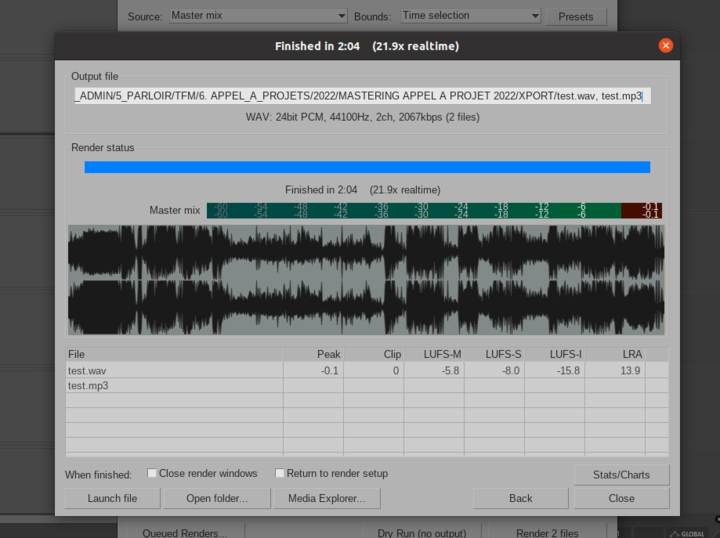

**Verification et conformation des audios**

objectif : à partir du support fourni par le/la participant.e préparer un audio prêt à publier, le plus propre et équilibré possible, en mp3 160kbps + archive web

Pour cela : 

- si session reaper : 
    contrôler qu’il n’y a pas de saturation sur le mixage , éventuellement peaufiner équilibrage du mixage et clean des points de coupes (mais ça peut vite prendre bcp de temps), dans tous les cas vérifier les effets insérés sur la piste master pour s’assurer qu’ils ne dégradent pas le son et au besoin mettre nos réglages mastering de base (rea x comp pour viser un loudness de sortir à environ -14dbfs), export dans les formats usuels pour la plateforme (voir plus haut)  
- si fichier audio wav : 
    le traiter dans reaper en vérifiant si pas de silence inutile en intro extro, normaliser le volume pour viser -14 dbfs , si la dynamique semble mal maîtrisée appliquer nos réglages mastering de base (voir plus haut), export dans les formats usuels pour la plateforme  
- si fichier audio mp3 (ou autre format destructif) : pas suffisant pour traitement, si à l’écoute la qualité et le loudness semblent ok pour diffusion passer au point suivant , sinon prendre contact pour obtenir fichier en format non destructif

**Infos complémentaires**

concernant le -14dbfs il s'agit du loudness, c'est à dire de la densité moyenne du signal. avec Reaper tu as une idée de ce niveau en faisant un export, il faut regarder l'indication 'LUFS-I', cf capture

ici par exemple le LUF-I est à -15.8 donc on aurait plutôt tendance à augmenter le niveau général, mais attention il faut faire l'ajustement avec le limiteur car si on le fait au niveau de la piste master ça va saturer (on voit d'ailleurs clairement qu'il le niveau atteint déjà le niveau maximum en sortie du bus master). Il faut donc ici baisser le threshold tu limiteur pour augmenter la densité du signal. Si on avait été au dessus de -14dbfs il aurait fallu augmenter le threshold sur le limiteur , voir baisser le niveau de sortie de la piste master si le threshold est déjà 0. Dans tous les cas il faut faire attention à ce que le limiteur soit toujours le dernier traitement audio appliqué à la piste master, et ne jamais monter le niveau de la piste master au dessus de 0db

En compléments :  
* https://www.youtube.com/watch?v=0wPnlND92QU
* un plugin de visualisation du niveau LUFS en temps réel disponible sur Reaper : JS: Loudness Meter Peak/RMS/LUFS (Cockos)
